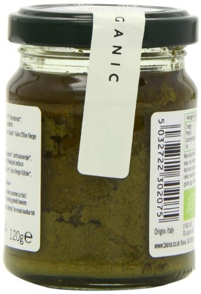
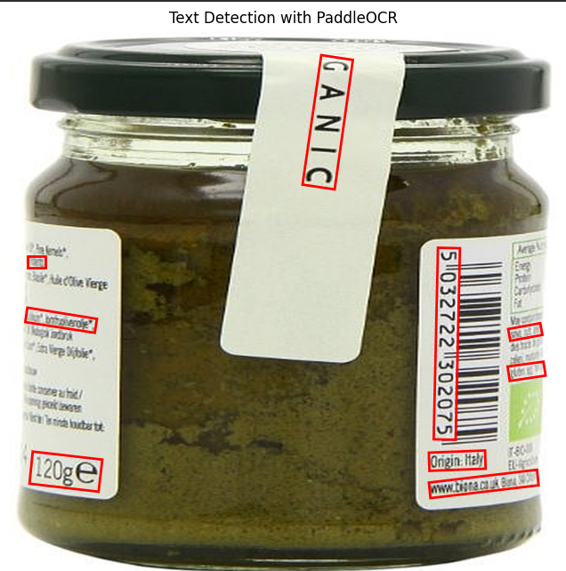
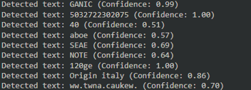
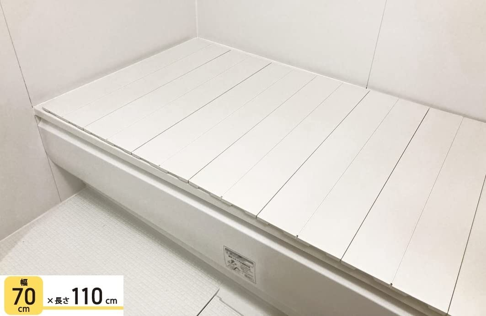
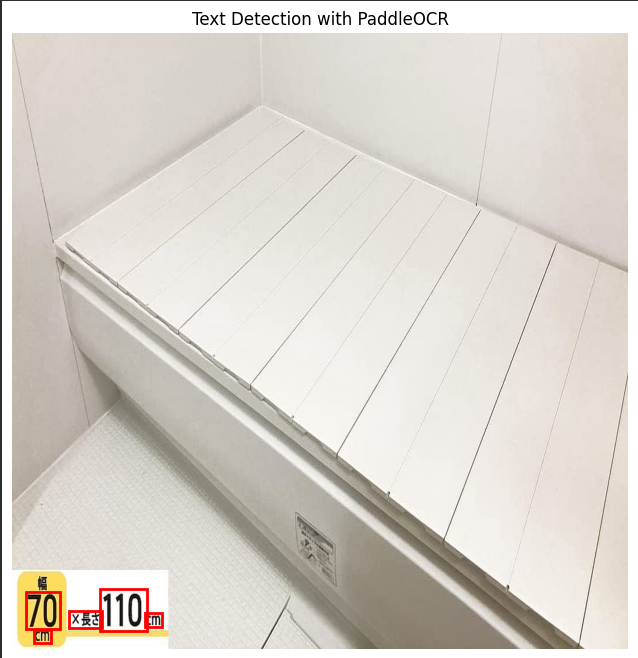
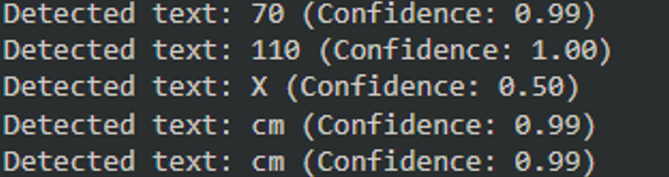

  

<h3 align="center">Image Text Extraction with Enhanced Clarity using PaddleOCR</h3> 

<h2>Introduction</h2>
  
This model leverages PaddleOCR for efficient text extraction from images, enhanced through preprocessing techniques to improve clarity and recognition accuracy. By adjusting sharpness and resizing the image, the model optimizes the quality of input before applying OCR, ensuring more reliable text detection. The extracted text, along with confidence scores, is displayed, and bounding boxes are drawn around the detected text for visual representation. This approach makes it a powerful tool for automated text recognition in images, ideal for document analysis, image-based data extraction, and more.
  

<!-- ABOUT THE PROJECT -->
## About The Project

This model is designed to perform high-accuracy text extraction from images using PaddleOCR, a lightweight and efficient OCR system. The process begins by uploading an image, which is then processed using OpenCV. One key feature of this model is its image enhancement function, which sharpens and resizes the image to improve text clarity before performing OCR. This preprocessing is crucial for cases where the image may be blurry, low-resolution, or otherwise difficult for the OCR system to interpret accurately. By enhancing sharpness and resizing the image, the model boosts the chances of accurate text detection.
 

The core of the model lies in its use of PaddleOCR, an open-source text detection and recognition library that supports multiple languages and scripts. PaddleOCR is configured to detect and recognize English text in this model, though it can be adapted for other languages. Once the image is enhanced, the OCR model scans it, detecting text and outputting both the recognized characters and the confidence level of each detection. This confidence score is essential for determining the reliability of the extracted text, allowing the user to gauge how likely it is that the detected text is correct.

After text detection, the results are visualized using Matplotlib. Bounding boxes are drawn around the detected text regions, making it easy to see where the text is located within the image. These bounding boxes are displayed on top of the image itself, providing an intuitive way to review the detected text and its placement. This step adds a visual validation layer, enabling users to verify that the OCR has correctly identified all necessary text elements.

Overall, the model offers a streamlined yet powerful tool for text recognition in images. The combination of image enhancement, robust text detection, and clear visual output makes it suitable for various applications, including document analysis, image-based text extraction, and data entry automation. With a focus on improving accuracy and usability, this model serves as an effective solution for extracting text from images in different scenarios.

## Key Features

### Image Enhancement
* Sharpens and resizes the image for better text clarity before OCR processing.

### PaddleOCR Integration
* Utilizes PaddleOCR for efficient text detection and recognition, supporting multiple languages.

### Confidence Scores
* Provides confidence levels for each detected text, indicating the accuracy of recognition.

### Visual Text Detection
* Draws bounding boxes around detected text regions for clear visualization of results.

### Flexible Application
* Suitable for various tasks like document analysis, image-based data extraction, and automation.

## Input & Output
### Image 1

 

        
        
        
    

### Image 2

 

        
        
        
    

## Conclusion
In conclusion, this model provides a highly effective solution for extracting text from images, combining image enhancement techniques with the robust capabilities of PaddleOCR. By improving image clarity through sharpness adjustments and resizing, it ensures higher OCR accuracy, making it ideal for handling challenging inputs like low-resolution or blurry images. The integration of confidence scores and visual bounding boxes offers users greater control and validation over the text detection process. Overall, this model is a versatile tool for automating text recognition in various domains, from document processing to data extraction.

Project Link: 
